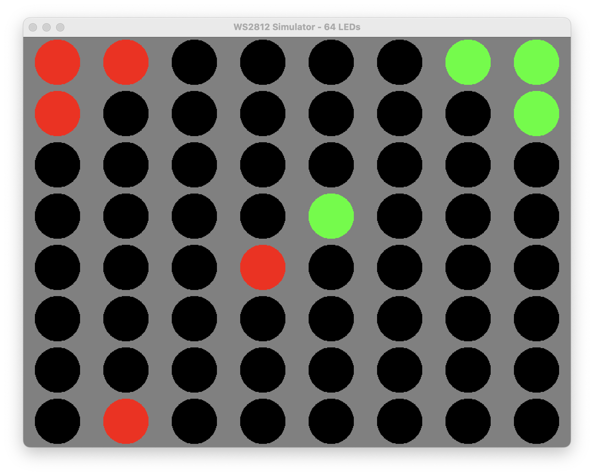

# Ws2812 Simulator

Simulate WS2812 LEDs on a computer that is not a Raspberry Pi!

This is a drop-in replacement for the [Ws2812 gem](https://github.com/wejn/ws2812) that allows you
to develop for WS2812 LEDs without having to write/run your code on the Raspberry Pi. Once you are
finished, swap this gem for the original Ws2812 gem and run with real hardware.

The gem uses [Ruby2D](https://github.com/ruby2d/ruby2d) to give you a "virtual led display" on your
computer that will reflect the LED state as though they were real LEDs.

]

## Installation

Do the usual dance, either:

```
# In your shell
$ gem install ws2112_simulator`

# In your Ruby
require 'ws2812_simulator'
```

..or..

```ruby
# Add this line to your application's Gemfile and then run `bundle`
gem 'ws2812_simulator'
```

## Usage

Since this is designed to have the same API as the functional gem you use it in the same way and
with the same code. All you have to do is require the appropriate file in your code. You've got two
options.

A) Use `require 'ws2812_simulator'` and replace all calls to `Ws2812` with `Ws2812Simulator`.
B) Use `require 'ws2812_simulator/drop_in_replacement'` which will _automatically alias the `Ws2812` constant to `Ws2812Simulator`.

Option "B" is preferred because you only have to swap out one line of code to make the switch.

### MacOS Specific Issues

To function correctly, you must set the `OBJC_DISABLE_INITIALIZE_FORK_SAFETY` environment variable
to `YES`. You can do this on a per-command basis like this:
       
    $ OBJC_DISABLE_INITIALIZE_FORK_SAFETY=YES ruby <.rb file path>
       
..or export the variable in your shell:
    
    $ export OBJC_DISABLE_INITIALIZE_FORK_SAFETY=YES
    $ ruby <.rb file path>

## Examples

There are examples in the [examples](examples/) directory. These are **exactly** the same as the examples included with the Ws2812 gem except they use `ws2812_simulator/drop_in_replacement` instead of `ws2812`. 

## TODO

* Make Gamma Work

## Development

After checking out the repo, run `bin/setup` to install dependencies. Then, run `rake spec` to run the tests. You can also run `bin/console` for an interactive prompt that will allow you to experiment.

## Contributing

Bug reports and pull requests are welcome on GitHub at https://github.com/xunker/ws2812_simulator. This project is intended to be a safe, welcoming space for collaboration, and contributors are expected to adhere to the [Contributor Covenant](http://contributor-covenant.org) code of conduct.

## License

The gem is available as open source under the terms of the [MIT License](https://opensource.org/licenses/MIT) because I'm too lazy to choose a different one.
